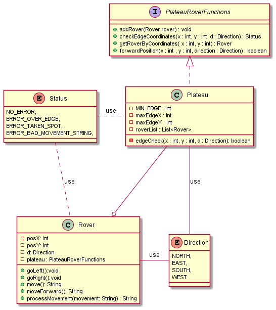

**TTD Mars Rover kata**
=====================

###What is a kata?
A Kata in martial arts means “a system of individual training exercises”. Just like in martial arts, coding also requires consistent practise to hone in the skill.

###What is the goal?
You have been asked to create a program to move rovers around the surface of Mars! The surface of Mars is represented by a Plateau, you can make the assumption that the Plateau is a square/rectangular grid for the purpose of this task. Rovers navigate the Plateau so they can use their special cameras and robot arms to collect samples back to Planet Earth.

###Assumptions:

 - The surface is square/rectangular
 - Bullet listThe coordinates begin at 0,0
 - The rovers only move forwards one square at a time
 - Cannot go over the side of the plateau - no minus numbers
 - Rovers cannot occupy the same area
 - Rovers turn 90 degrees so can only move vertically and horizontally
 - Each L or R instruction is only 90 degrees
 - Movement instructions can only be made up of "LRM"

### Implementation
* The main purpose of this application is to navigate rovers on the plateau.
  * Started with creating small isolated tests for plateau and rover both differently.
  * PlateauTest has tests to check for plateau edge test, user input validation test etc
  * RoverTest contains test to check against the rover position, user input validation for rover position etc
  * PlateauRoverTest contains test to check rover on the plateau and checking the movements, also doing edge check and collisions.
  * The size of the plateau is decided by the user input
  * The initial position and direction is take from user input. Then we check if the rover's position is within the plateau size ie - edge check.
  * Then we take user instruction to move the rover in a particular direction.
  * We can only move left, right or forward.
  * Here we do collision check, we are checking if there is already a rover in that position.
  * If another rover is already present on that position, then we stop the rover just before collision.

### Class Diagram
Here i have mapped out the structure of the Mars Rover navigation system by modeling its classes, attributes, operations and relationships between objects :

* There are two main classes and and interface : 
  * PlateauRoverFunctions : 
    * Declares functions which the plateau class must implement
  * Plateau : 
    * This class has x & y coordinate which denotes the size of the plateau.
    * This class provides implementation for the interface methods. 
    * Plateau holds list of rover, as it must be aware about all the rovers on the plateau.
  * Rover :
    * The Rover class needs to know the limits of the plateau, so it contains a PlateauRoverFunctions. By using an interface, the circular reference is broken, this way the rover cannot access the plateau object itself, but only its behaviour (interface methods).
  * Direction :
    * This is an enum class with directions ie - North, South, East, West
  * Status :
    * This is an enum class which is used for error messages.
  * Main :
    * This the implementation of console application. 

###How to run the application
* cd to the project root folder in the command line
* mvn compile
* mvn exec:java -Dexec.mainClass=com.Jayshree.MarsRover.Main

###To run tests use:

* mvn test

###Technology
This project was built using:

* Java 17.0.2
* JUnit 5.8.2
* Maven 3.8.5
* IntelliJ 2021.3.2 (Community Edition).